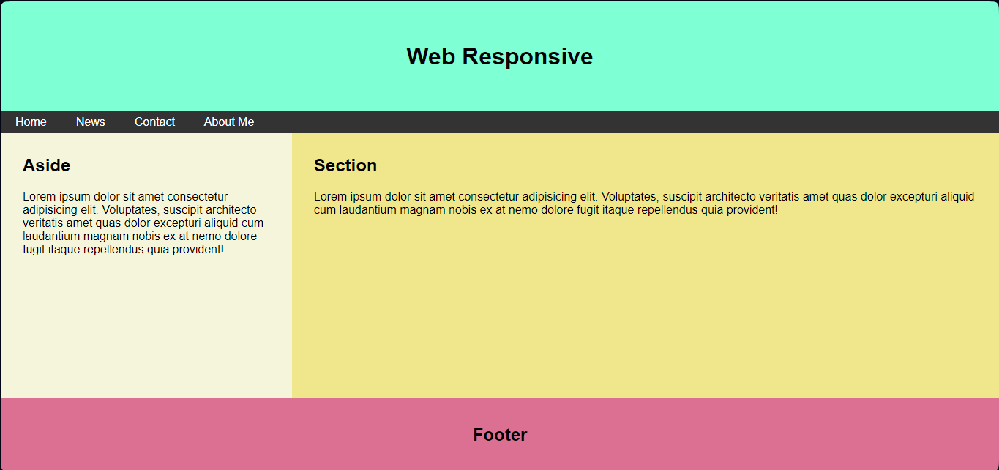
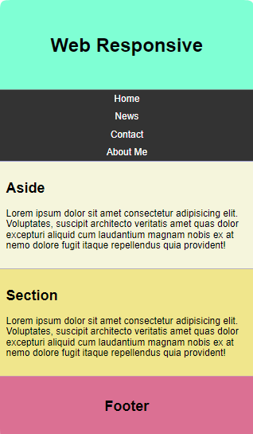

# Web Responsive

In this project, i've implemented a **Responsive menu** using **Flexbox** and following the **Mobile-First** approach.

## Desktop View

## Mobile View

---

[Visit my page](https://osotripolar.github.io/Practices-flexbox-menuResponsive "click to visit the page")